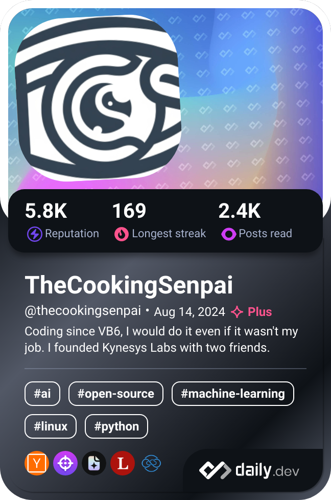

<h3 align="center">Always verify my <a href="https://keys.openpgp.org/search?q=tcsenpai%40discus.sh">public key(s)</a></h3>

  <ul align="center" style="list-style: none">
    

      <h1>
        👋 Hi, nice to meet you! I am TCSenpai!
      </h1>
    

  </ul>

**<h3 align="center">Connect with me:</h3>** 

 

 **<h3 align="center">🚀 I am mostly a backend developer, working in TypeScript, Python, Bash and some other languages. I am CTO at KyneSys Labs and I love experimenting in my free time.</h3>**

**<h3 align="center">I am a digital privacy advocate, so I try to self-host most of the things I can self-host.</h3>**

**<h3 align="center">Feel free to take a look!</h3>**

**<h3 align="left">Rapid Fire</h3>**

- 💼 I'm currently working on: **💻 Creating the Omniweb @ KyneSys Labs**
- 💬 Ask me about: **💡 TypeScript, Javascript, Python, Blockchain and more**
- 📝 Blog: **<a href="https://space.tcsenpai.com" target="_blank">https://space.tcsenpai.com</a>**

 **<h3 align="left">Skills</h3>**

       

 **<h3 align="left">GitHub Stats</h3>**

  
  

  

